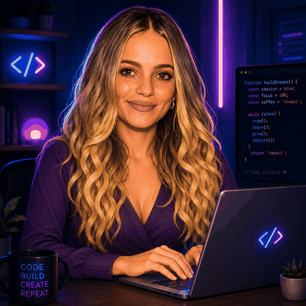

  

  

---

<table align="center">
  <tr>
    <td align="center" rowspan="4" width="35%">
      
    </td>
    <td align="right"><strong>Frontend</strong></td>
    <td align="left">
      
    </td>
  </tr>
  <tr>
    <td align="right"><strong>Backend</strong></td>
    <td align="left">
      
    </td>
  </tr>
  <tr>
    <td align="right"><strong>Database</strong></td>
    <td align="left">
      
    </td>
  </tr>
  <tr>
    <td align="right"><strong>Strumenti</strong></td>
    <td align="left">
      
    </td>
  </tr>
</table>

---

